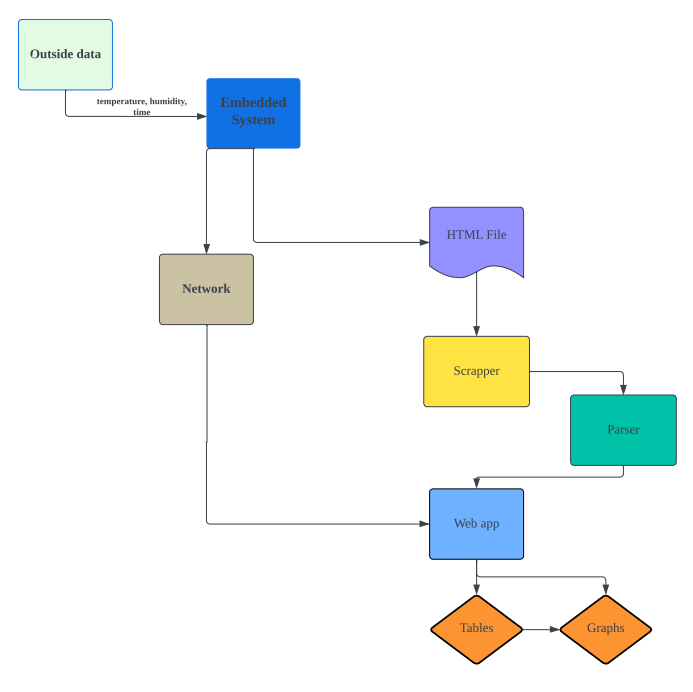

# Aerospace IOT

## Introduction:
The Aerospace IOT created throughout this project is a special sensor made using an embedded system that is capable of obtaining accurate atmospheric data in real-time, such as internal temperature, temperature, humidity, and run time. The obtained data is sent to the web app that handles data collection and data scientific analysis for scientific research.

## Technical Architecture

## Developers
  * Bryant Hsiung: Worked on the middle end of the project, connecting both the embedded system and the back end of web app. 
  * Jack Pec: Worked on the embedded system, constructing the Arduino parts connected to Raspberry Pico w and coding it.  
  * Jennifer Lopez: Worked on the Front end and back end of the web app, designed and structured the web app. 
  * Yushin Kim: Worked on the front end and back end of the web app, designed and structured the web app. 
## Environment Setup
### Initial Virtual Environment Installation (venv)
`python3 -m venv ./venv`
### Run venv
`source myenv/bin/activate`
### Initial Django Installation
`pip install Django==4.2.5`
### Initial BeautifulSoup Installation
`pip install beautifulsoup4`
### Initial Pandas Installation
`pip install pandas==2.1.3`
### Initial urllib3 Installation
`pip install urllib3`
### Initial numpy 1.26.2 Installation
`pip install numpy==1.26.2`
### Initial matplotlib 3.8.2
`pip install matplotlib==3.8.2`

## Project Instruction
1. Go to the terminal
2. Activate venv
   `source myenv/bin/activate`
3. Start the development server
   `python manage.py runserver`
4. The command above will return an ip address
5. Copy the address and paste it into the web search bar and type /home after the address.
6. This will take you to the home page.
   
   
   
## Environment Setup For Embedded System 
 1) Install the ide called Thonny 
 2) Download web_server_with_dht11_sensor.py from github repo
 3) Open file through Thonny, then upload to pico w through usb cable, and run it 